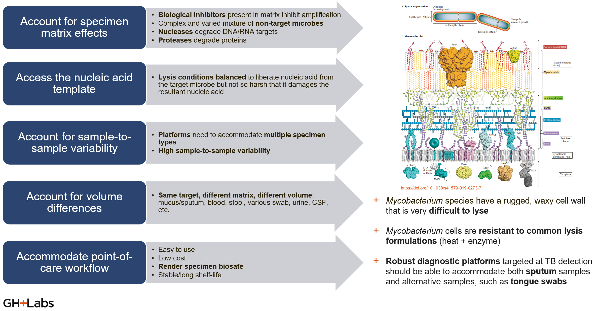
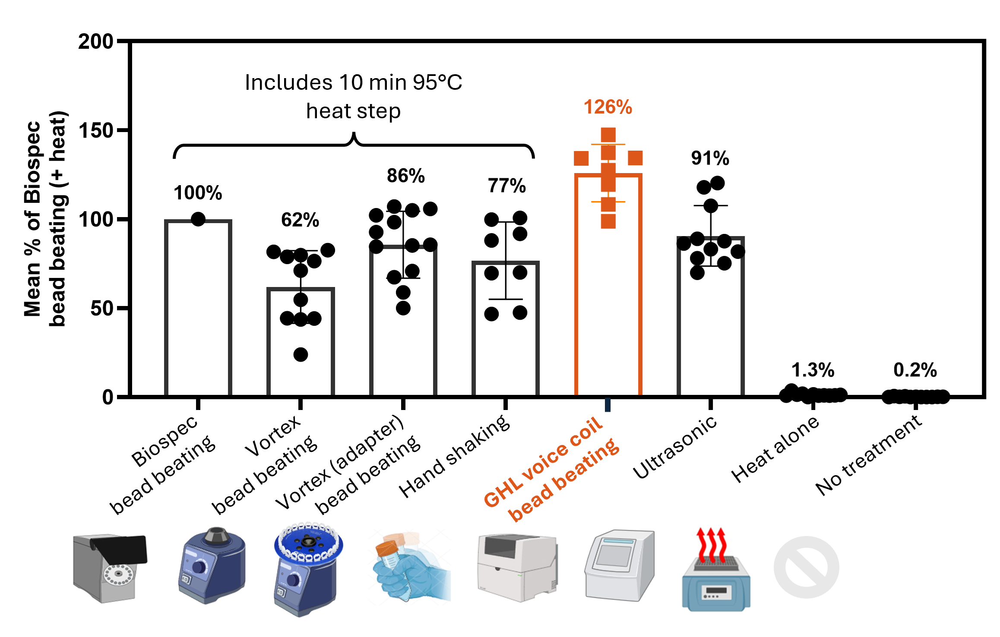
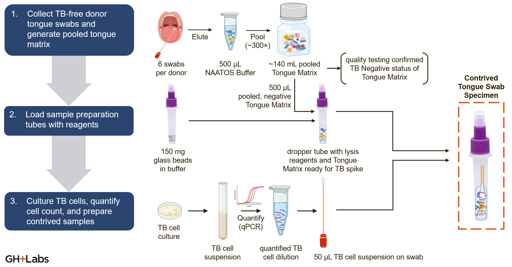

# Development History

## Problem Statement

Health care providers and patients in low- and middle-income country (LMIC) point-of-care (POC) settings need a rapid diagnostic test for tuberculosis (TB) that provides an accurate bacteriological confirmation of TB during the same clinical encounter for effective linkage of care. Patients need a non-invasive and efficient testing experience, while health care providers need a test that can rapidly and accurately diagnose TB, allowing for timely treatment and prevention of disease transmission.

However, health system levels at Level 0 (community), Level I (primary health care facilities with limited lab capabilities), and Level II (first referral health facilities with basic lab capabilities) lack a viable rapid diagnostic test for TB that offers high sensitivity at low cost which does not require maintenance. Molecular diagnostic solutions exist in LMICs, but are mostly off-site, expensive to run and maintain, and often incur long waits for results from providers and patients. Antigen-based diagnostic solutions are typically more available and cost-effective, but lack the sensitivity and sophistication needed to improve case-finding in endemic regions.

!!! quote
    “TB is killing our people down there because when you look at the access to testing if I am to say we are in XXX, apart from microscopy which we mostly use for follow-up; here at the hub but we have only two facilities in the entire district that have GeneXpert and we are overwhelmed with samples.”

    &mdash; *Provider from GHL and The Better Lab study (Using Human-Centered Design to Design a Novel COVID-19 Nucleic Acid Amplification Test among End-Users in Uganda)*

The global problem and the opportunity for diagnostic test developers are succinctly illustrated by the following statistics:

- **10.6 million**[^1] people fell sick with TB in 2022
- **30%**[^1] gap between the incident and notified cases of TB, 2018
- **8%**[^2] CAGR from 2020 to 2027
- **325 million USD**[^2] LFA based TB market by 2027
- **10.7%** CAGR from 2020 to 2027 for STIs ($798 M LFA based STI market by 2027) – Platform Expansion

Some of the most imposing technical challenges presented to *in vitro* diagnostic test developers by tuberculosis infections are related to the difficulties of sampling Mtb from humans and then preparing the sample to work with a biochemical assay. In this context, the nPOC-BB originated from a sample preparation method targeted to the tuberculosis-specific challenges of sample preparation and to tongue swabs as an easier-to-manage alternative specimen type to sputum for NAAT-type assays. This page gives an overview of these topics as they relate to the history of nPOC-BB product development.

## Tuberculosis-specific challenges of sample preparation for *in vitro* diagnostics

Mtb cells are very difficult to lyse and are therefore resistant to common lysis techniques, which typically include heat treatment (often boiling of cells)and sometimes include enzymes or chemicals that can increase the disruption of cell walls and hasten lysis. These thermal and (bio)chemical techniques require significant cleanup to allow detection of those targets by biochemical assays and/or take too long to release molecular targets from Mtb. Sputum, the most common specimen type for TB diagnostics, adds its own challenges to sample preparation, as it is a highly viscous sample matrix containing mucins and other natural biochemical inhibitors. Therefore, alternate sample preparation techniques, and even alternate specimen types, are desirable innovations in the context of sample preparation for TB diagnostics. A summary of the high-level design criteria for the nPOC-BB, and other Mtb sample preparation innovations, follows, but a full set of original [design inputs for the nPOC-BB](./inputs/rtm.md) also exists.

- Account for specimen matrix effects
    - Biological inhibitors present in matrix inhibit amplification
    - Complex and varied mixture of non-target microbes
    - Nucleases degrade DNA/RNA targets
    - Proteases degrade proteins
- Access the nucleic acid template
    - Lysis conditions balanced to liberate nucleic acid from the target microbe but not so harsh that it damages the resultant nucleic acid
- Account for sample-to-sample variability
    - Platforms need to accommodate multiple specimen types
    - High sample-to-sample variability
- Account for volume differences
    - Same target, different matrix, different volume: mucus/sputum, blood, stool, various swab, urine, CSF, etc.
- Accommodate point-of- care workflow
    - Easy to use
    - Low cost
    - Render specimen biosafe
    - Stable/long shelf-life

/// caption
Figure 1: Challenges of, and high-level design criteria for, Mtb sample preparation methods.
///

## Tongue swabs as an alternative specimen type to sputum in tuberculosis diagnostics

Global Health Labs has actively participated in a global research effort to establish the diagnostic accuracy of dorsal tongue swabs because sputum-based testing is a barrier to access for TB diagnostics. Sputum can be difficult or impossible to produce, especially for children and people living with HIV; sputum collection can be difficult to manage safely and can introduce contamination to the test or others; and sputum processing increases assay complexity, time, and cost.

The following references describe more of the work by Global Health Labs on tongue swabs for TB, including detailed protocols for evaluating the quantitative performance of these methods.

- Alfred Andama, Amy E Steadman, Charlotte Ahls, Gerard Cangelosi, Anura David, Margaretha de Vos, Karen Heichman, Midori Kato-Maeda, Adam Penn-Nicholson, Alaina Olson, Lesley Scott, Lindsey Turnbull, Rachel Wood, Kris Weigel, Adithya Cattamanchi (2024). "[Consensus standard operating procedure for collection of tongue swabs for TB diagnostics](https://dx.doi.org/10.17504/protocols.io.kxygxyw54l8j/v1)." Protocols.io, 29 Jul 2024.
- Rachel C. Wood, Alfred Andama, Gleda Hermansky, Stephen Burkot, Lucy Asege, Mukwatamundu Job, David Katumba, Martha Nakaye, Sandra Z. Mwebe, Jerry Mulondo, Christine M. Bachman, Kevin P. Nichols, Anne-Laure M. Le Ny, Corrie Ortega, Rita N. Olson, Kris M. Weigel, Alaina M. Olson, Damian Madan, David Bell, Adithya Cattamanchi, William Worodria, Fred C. Semitala, Akos Somoskovi, Gerard A. Cangelosi, Kyle J. Minch (2021). "[Characterization of oral swab samples for diagnosis of pulmonary tuberculosis](https://doi.org/10.1371/journal.pone.0251422)." PLoS ONE 16(5): e0251422.
- Amy Steadman, Alfred Andama, Alexey Ball, Job Mukwatamundu, Khushboo Khimani, Tessa Mochizuki, Lucy Asege, Alice Bukirwa, John Baptist Kato, David Katumba, Esther Kisakye, Wilson Mangeni, Sandra Mwebe, Martha Nakaye, Irene Nassuna, Justine Nyawere, Annet Nakaweesa, Catherine Cook, Patrick Phillips, Talemwa Nalugwa, Christine M Bachman, Fred Collins Semitala, Bernhard H Weigl, John Connelly, William Worodria, Adithya Cattamanchi (2024). "[New Manual Quantitative Polymerase Chain Reaction Assay Validated on Tongue Swabs Collected and Processed in Uganda Shows Sensitivity That Rivals Sputum-based Molecular Tuberculosis Diagnostics](https://doi.org/10.1093/cid/ciae041)." Clinical Infectious Diseases, Volume 78, Issue 5, 15 May 2024, Pages 1313–1320.

/// caption
Figure 2: Overview of protocol for generation of contrived tongue swab specimens, which can be used to evaluate Mtb lysis efficiency of various sample preparation methods on this specimen type.
///

In parallel, Global Health Labs has worked on evaluating established and novel sample preparation methods for Mtb cells from tongue swab specimens, with the goal of maximizing amplifiable nucleic acids for direct transfer to molecular diagnostics. The outcome of this work is the nPOC-BB, but also the observation that sufficient mechanical agitation combined with heating will efficiently lyse Mtb cells, although simultaneous thermal and mechanical treatment is more efficient than serial thermal then mechanical treatment. However, even hand shaking after heating gives relatively good performance! (Although it does get tiring to rapidly shake a tube for 5 full minutes).

/// caption
Figure 3: Comparison of lysis efficiency, on contrived tongue swab specimens (that included a fixed number of cultured Mtb cells), across various sample preparation methods. Heat only and no treatment controls sit in contrast to methods that combine heating and mechanical agitation of the cells. The nPOC-BB condition gave the best performance (126% lysis efficiency as measured relative to the laboratory benchtop control, a Biospec bead beater), but more optimized solutions may yet exist.
///

[^1]: WHO. [Global Tuberculosis Report 2024](https://www.who.int/teams/global-tuberculosis-programme/tb-reports/global-tuberculosis-report-2024).

[^2]: Markets and Markets. [Lateral Flow Assay Components Market - Global Forecast to 2027](https://www.marketsandmarkets.com/Market-Reports/lateral-flow-assay-components-market-45058941.html).
