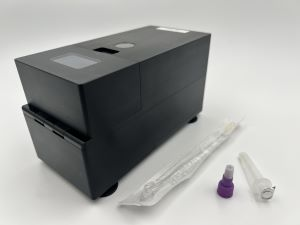

# Introduction

## Overview

{ align=right}

The Near Point-Of-Care Bead Beater (**nPOC-BB**) is a portable sample preparation instrument that was designed to:

1. produce a biosafe cell lysate,
2. release amplifiable cellular nucleic acids, and
3. stabilize released nucleic acids by thermal denaturation of nucleases;

all from a minimally treated human specimen, especially when collected by a swab and transferred into a small (<2 mL) dropper tube filled with buffer and micro-scale glass beads. Collectively, this intended use enables molecular diagnostic applications for detecting difficult-to-lyse pathogens in human biological specimens in a variety of settings.

The mechanisms by which the device achieves these intentions are a combination of heating to near-boiling liquid temperatures and rapid shaking (also known as "bead beating") to shear-force-inducing frequencies. Both mechanisms are important: the heating increases susceptibility of microorganisms to killing and lysis, which improves biosafety and contributes to lysis efficiency, and decreases nuclease activity, which stabilizes the released nucleic acids in the resulting lysate; the shaking drastically increases lysis efficiency, which releases more amplifiable nucleic acids into the resulting lysate than heating alone. We typically measure lysis efficiency by the quantity of amplifiable nucleic acids released from target cells in the sample.

Data generated on this instrument at Global Health Labs (**GHL**), its original developer, show that for difficult-to-lyse cellular microorganisms, such as *Mycobacterium tuberculosis* (**MTb**), heating alone results in almost no lysis efficiency, while shaking alone (such as with a lab-grade bead beater or homogenizer) results in reduced lysis efficiency, compared to heating and shaking together. Therefore, we created the nPOC-BB instrument for you, the diagnostic test developer who requires a low-cost, portable, robust, and rapid method for the efficient preparation of a sample to be used in a nucleic acid amplification test (**NAAT**).

The goal of this documentation is to describe the nPOC-BB instrument as a stand-alone instrument whose principles may be replicated in commercial diagnostic (global) health care products, but the development of this specific instrument took place within the context of the development at GHL of **[NAATOS][1]**, a diagnostic system for the nucleic-acid-based detection of MTb from human tongue swab specimens. However, because the nPOC-BB has also been shown to yield high lysis efficiency of MTb in human sputum samples, which is an excellent model for a difficult-to-lyse organism in a challenging sample matrices, we believe this instrument will be useful beyond the original application—a claim that of course must be validated in your own context.

## Quick Start

1. Place the nPOC-BB unit on a flat and debris-free surface.
2. Ensure the unit is well-adhered via its suction feet to the surface.
3. Ensure the Power Switch is on and Battery LED is yellow or white.
4. Open the Sample Compartment Lid and insert the Sample Tube into the Sample Tube Holder. Ensure the Sample Tube is aligned properly and press the Sample Tube firmly so that it clicks into the Sample Tube Holder.
5. Close the Sample Compartment Lid and press the Start Button. Observe the Status LED change to breathing green.
6. Wait 8.5 minutes.
7. When both Status and Battery LEDs turn to solid green the cycle is complete. Open the front cover and remove the sample. It is now lysed and read to be added to the NAATOS test device.

!!! warning
    Sample Prep Tube will be HOT when removed from device.

## Authors

- [Josh Bishop](https://github.com/jdbishop)
- [Stephen Burkot](https://github.com/sburkot24)
- [Ryan Calderon](https://github.com/rcalderon04)
- [Simon Ghionea](https://github.com/sghionea)
- [Chin Ng Hei](https://github.com/ngchei)
- [Andrew Miller](https://github.com/andrewmiller-ghl)
- Jamie Purcell

[1]: <https://www.ghlabs.org/innovations/next-generation-dx-platforms-2> "NAATOS: Nucleic Acid Amplification Test On a Strip"
