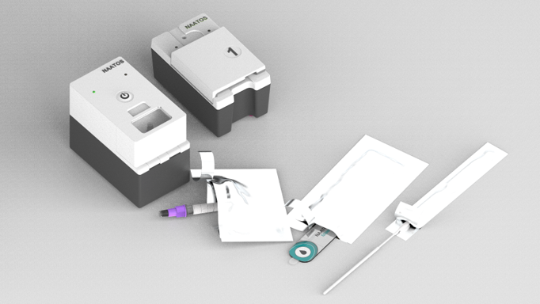
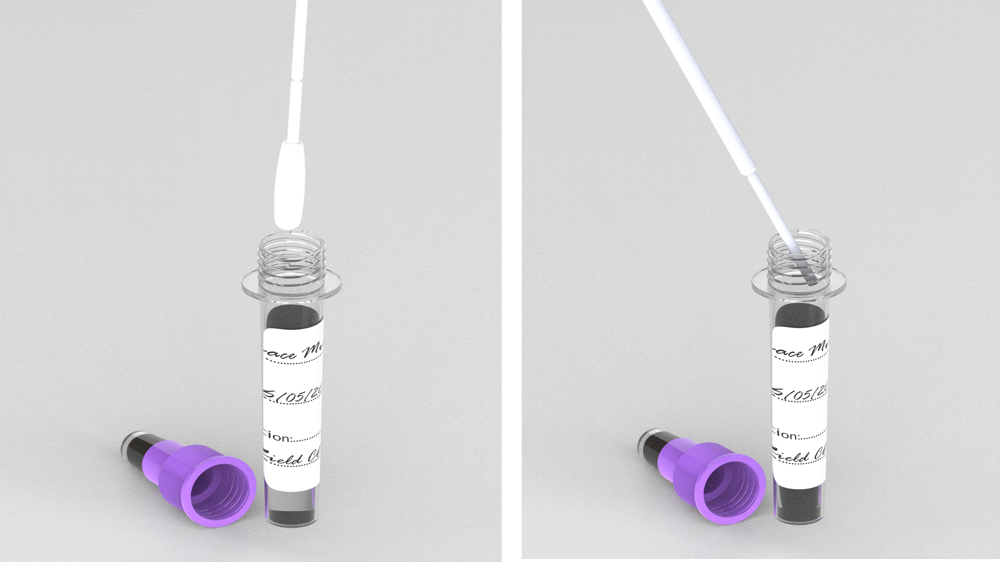
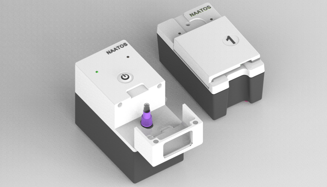

# Usability / Formative Feedback

## Overview

In partnership with [Market Access Africa (MAA)](https://www.marketaccess.africa/) and [Health Innovation Advisors (HIA)](https://innovationadvisors.org/), Global Health Labs (GHL) conducted in-person, moderated, usability interviews using a structured guide to lead participants through six tasks, ask follow-up questions, and observe their behavior with 40+ stakeholders at 13 primary health care facilities in Kenya and South Africa. The first three tasks, excerpted feedback, and key recommendations listed below are specific to the **Alpha version** of the nPOC-BB, which was the sample preparation subcomponent of a larger diagnostic system, called NAATOS, in this usability assessment. The full report on this NAATOS usability assessment, including the nPOC-BB, can be found at **REPLACE**.

Task 1: Open and label consumables - sample tube and test device

Task 2: Collect the tongue swab from the patient, break off the swab head directly into the sample tube, and close the tube

Task 3: Place sample tube into sample prep module and press "start" to process sample

(Tasks 4-6, N/A)

## Summary of Feedback

### User Cadre

Nurses, clinical officers, community health workers and lab technicians were all able to run the test with independence. These professionals often manage multiple responsibilities and face challenges, such as sample handling and a lack of timely access to test results.

### Sample Handling

Proper training on sample handling is crucial to minimize contamination risks. Observations included practices like placing tubes on their sides when open. Design modifications (e.g., wider base for sample tubes) could reduce spillage risks.

### Problem Areas

* 13 of the 18 participants had difficulty finding the sample module lid

    !!! quote
        "You must make this thing (sample module) just like this black here, white here, so that we can see. Now it's all black. I don't see anything…this thing man needs to be two colors. I can't see that there was a door."

        &mdash; *52-year-old female nursing assistant from South Africa*

* 16 of the 18 participants had challenges placing the sample tube into the sample module

    !!! quote
        "I struggle in inserting it. I thought that was the end of it, but again, if I press it down, it went again deeper. That is the only challenge. And then I was also struggling because I've not learned about the machine. I was struggling to open and see where to put the sample tube, but later on I found the path about it."

        &mdash; *35-year-old male nurse from Kenya*

* 9 of the 18 participants did not close the lid before pressing start
* 3 of the 18 participants had trouble finding the start button

## Key Recommendations

### User Interface and Interaction

* **Separate Power On and Start Functions**: Redesign the interface to have distinct buttons for power on and start to avoid confusion
* **Intuitive Start Button**: Ensure the start button is clearly labeled and intuitive to use
* **Sample Module Lid**: Redesign the sample module lid to be easier to locate and open, possibly with visual cues or ergonomic design improvements
* **Tube Insertion Guidance**: Implement a mechanism or visual guide to ensure users insert the tube fully, allowing the sample prep module to close properly

### Notifications and Indicators

* **Battery Life Indicator**: Add a clear battery life indicator (battery icon) to keep users informed about remaining power levels.
* **User-Friendly Indication Lights**: Redesign indication lights to be more user-friendly and self-explanatory without requiring extensive instructions. Consider adding labels or using a more intuitive UI/UX design. Ensure feature is consistent or equivalent for both modules.

### Workflow and Efficiency

* **Reduce Sample Prep Time**: Optimize the sample prep process to minimize disruptions and ensure a smooth workflow from sample processing to result readout
* **Consistent Power On Feature**: Ensure the power on feature is consistent and equivalent for both modules to avoid user confusion

### Design and Ergonomics

* **Alternative Power On and Start Features**: Explore alternative designs for the power on and start features to clearly differentiate them
* **Grips on Sample Module Door**: Consider adding grips on the sides of the sample module door as an alternative to the current pull-down design from the to

### Security and Maintenance

* **Battery Theft Prevention**: Implement measures to prevent battery theft
* **Forced Charging**: Ensure both modules are charged simultaneously to avoid one being left uncharged
* **Sample Processing Confirmation**: Develop a downstream control mechanism to confirm successful sample processing and prevent premature removal
