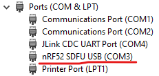

# Programming Instructions

## Config / Logs

On an nPOC-BB (Gamma) unit running firmware v3.1 or later, the file system on the exposed mass storage device and NOR flash 1Gbit storage contains the two subdirectories `config` and `logs`, which contain the files for the configuration of the device and all logs created by the device, respectively. Below is an example filesystem from a nPOC-BB (Gamma) unit running firmware v3.5 that has been configured to operate four distinct cycles in a run and has logged two distinct runs.

    \
    ├─ config
    │   ├─ config_v3.5.txt
    │   ├─ cycle_config_1.txt
    │   ├─ cycle_config_2.txt
    │   ├─ cycle_config_3.txt
    │   └─ cycle_config_4.txt
    └─ logs
        ├─ sample_05-21-25_121449.csv
        └─ sample_05-22-25_120343.csv

### Config

The `config` subdirectory contains text files that configure the operation of an nPOC-BB unit. The configuration files contain configuration parameters that either apply to the entire run, which may comprise one or more independent cycles, or to cycles, the number of which is configurable. A standard run on a nPOC-BB (Gamma) unit running firmware v3.5 is four cycles: startup; heating; heating and shaking, and passive cooling and shaking.

!!! note
    When a new firmware version is flashed onto a unit, the unit will compare the current firmware version to the Run Configuration file version in storage. If the Run Configuration file name (e.g., `config_v3.4`) does do not match the flashed firmware version (e.g., `v3.5`), the device will delete all configuration files from storage and create new configuration files that match the current version and contains default values. This functionality exists in the firmware to guarantee compatibility with the configuration files.

#### Run Configuration

A single Run Configuration file will be in the `config` subdirectory. The Run Configuration file is named after the current firmware of the device (e.g., `config_v3.5.txt` when the firmware version is `v3.5`). The Run Configuration file contains the parameters that configure unit operation for an entire run of one or more cycles (but does not configure the individual cycles; see below). The following table describes the firmware v3.5 Run Configuration parameters and lists their types, default values, and units.

{{ read_csv("docs/outputs/nPOC-BB_config_run_params.csv") }}

#### Cycle Configuration

One or more Cycle Configuration files will be found in the `config` subdirectory. The Cycle Configuration files are named for the cycle number (starting with `1` and proceeding in integer order, e.g., `cycle_config_1.txt`, `cycle_config_2.txt`, `cycle_config_3.txt`, and `cycle_config_4.txt`). Each Cycle Configuration file contains the parameters that apply to a single cycle. The default configuration for a nPOC-BB (Gamma) unit running firmware v3.5 uses four cycles defined by four Cycle Configuration files. The following table describes the firmware v 3.5 cycle parameters found in a Cycle Configuration file and lists their types, default values, and units.

{{ read_csv("docs/outputs/nPOC-BB_config_cycle_params.csv") }}

### Logs

The `logs` subdirectory contains log files in `*.csv` format. A new log file is generated for every power-on event and every run. A log file is named after the date and time of the event or run (e.g., `sample_05-21-25_121449.csv`).

A log file containers a header row and one or more data rows. Each data row is a single line of comma-delineated text that begins with a timestamp followed by the most recent sensor data gathered at `sample_rate` (a configuration parameter set in the Run Configuration file) and an `Event`, if one has occurred. `Event`-based log entries are generated at the time of the event. Non-`Event` log entries are generated at the `logging_rate` (a configuration parameter set in the Run Configuration file).

The following table contains the header row and the first three data rows of an example log file:

| Time | HeaterTemp | HeaterPWM | MotorSpeed | MotorPWM | Battery | BatteryV | BatteryT | Event |
| - | - | - | - | - | - | - | - | - |
| 2024-12-05 12:04:34 | 24.01 | 100.00 | 0.00 | 0.00 | 19 | 3.57 | 25.03 | Cycle 1 Started |
| 2024-12-05 12:04:35 | 26.39 | 100.00 | 0.00 | 0.00 | 19 | 3.63 | 25.05 | |
| 2024-12-05 12:04:36 | 29.77 | 100.00 | 0.00 | 0.00 | 19 | 3.64 | 25.60 | |

## Firmware

### Requirements

- Segger Embedded Studio software version 5.34 was originally used to develop the firmware. Later versions may also work.
- nRF Connect software was used to upload the firmware.
- An nRF PCA10040/56 or a Segger programmer connected to a 6-pin JTAG programming cable was used to program and communicate to the boards via both Segger Embedded Studio and nRF Connect.

### Environment

Open the code in Segger Embedded Studio go to `ProjectDir/application/solution/`. In this directory there should be `NAATOS_fw.emProject` which is the project file and can be double clicked to open the project inside of Segger Embedded Studio.


For opening the bootloader project, follow the same steps except follow the path `ProjectDir/bootloader/solution/` and open `NAATOS_bootloader.emProject`.

### Debug / Release Modes

Switching the project between Debug and Release can be done inside of the Project Explorer tab of Segger Embedded Studio.  


In most cases, the project should be inside of Debug mode when building the firmware. The only time the Release mode should be used for would be when creating final firmware builds to keep the optimization as high as possible and memory usage as low as possible.  

For the bootloader, ONLY the release mode should be used and not the debug mode. Building and using the bootloader inside of Debug mode will lead to the Bootloader not working and unable to update firmware properly.  

When building the application code, certain memory spaces may have to be changed depending on whether the resulting .hex file being produced will be used with or without a bootloader. The two cases being one where the bootloader is being used on the device and one that is not.  Depending on this the memory map for the device will need to be changed.  

When simple testing is required, and the bootloader is not needed on the board the memory space for the device needs to be modified so that it does not expect bootloader code within its memory.  This is done by modifying the linker options of the project. Follow these steps to modify the linker options:

1. Right click the project in the Project Explorer tab of Segger Embedded studios and select Options.  


2. Choose the build type for the Options, and set it to Common.  


3. Select Linker in the Options.  


4. Double click on the Section Placement Macros  


5. A property editor should then come up on the screen.  


6. Replace the Text with the following to make the application run without the need of a bootloader flashed onto the device:

        FLASH_PH_START=0x0
        FLASH_PH_SIZE=0x100000
        RAM_PH_START=0x20000000
        RAM_PH_SIZE=0x40000
        FLASH_START=0x0000
        FLASH_SIZE=0xF3000
        RAM_START=0x20000000
        RAM_SIZE=0x40000

    If the device is being programmed and the firmware image is expecting to have a bootloader on the device and contain the full firmware the following options need to be set:  

        FLASH_PH_START=0x0 
        FLASH_PH_SIZE=0x100000 
        RAM_PH_START=0x20000000 
        RAM_PH_SIZE=0x40000 
        FLASH_START=0x1000 
        FLASH_SIZE=0xF3000 
        RAM_START=0x20000008 
        RAM_SIZE=0x3FFF8 

### Bootloader

Triple-press the start button for the board to enter the bootloader from the application firmware. Bootloader must be programmed onto the board of a unit to enter the mode, or the unit end up in a hard fault state with the device crashing.  

There are four required files for full firmware programming of the device.

1. The **application firmware hex file** is the application code that we will be flashing onto the board and is generated with each revision of application firmware changes and can be overwritten.
2. The **bootloader firmware hex file** is the bootloader code that we will be flashing onto the board and is generated only once and cannot be overwritten.  
3. The **master boot record** is a static record of the bootloader and is taken from the nRF52840 SDK and not modified for this application, this cannot be overwritten.
4. The **bootloader settings hex file** is the setting for the bootloader to run on and tells the bootloader what to expect on a firmware upgrade. This can be regenerated as necessary but should not need to be as the bootloader will remain static.

To program the bootloader onto the device, Segger Embedded Studio cannot be used and nRF Connect must be used.  


Once nRF connect is downloaded and opened, you will want to open the Programmer Tool to program the device. The Programmer Tool will then open and the nRF52 DK can be selected as the programmer by clicking in the top left and selecting the nRF52 DK.  


Next all the firmware files can then be loaded into the Programming tool.  


When all firmware files are added to the programmer the File memory layout section should look like the image above.  

!!! note
    Ensure that the generated application firmware hex file is generated with the correct memory layout and expects the bootloader to be there.  

When the firmware files are loaded into the programmer the Erase and Write button can be pressed to write the full firmware to the device.  


There should be no red messages in the console log and the finishing programming line should be 'Reading readback protection status for Application core completed'.


After this the device has been fully programmed and has both the bootloader and the application firmware on the device and is ready for operation and future upgrades via the bootloader.  

### Generate Upgrade Package

To generate a package, first ```nrfutils``` must be installed which runs the entire firmware upgrade creation and flashing process. Can be downloaded here.

To create a package the following command must be run with ```nrfutils```:

    nrfutil pkg generate --hw-version 52 --sd-req 0x00 --application-version 4 --application Path/To/Application/Hex/File --key-file Path/To/Key/File naatos_dfu_package.zip 

This command takes in the newly created application firmware hex and our Odic generated key file which will be provided to create a .zip upgrade package with the given application firmware hex file.  

A script will also be provided which can be run to create a firmware upgrade package when the correct paths are set inside of it.  

### Flashing Upgrade Package

Now to flash the device, it must first be put into bootloader mode via clicking the button 3 times on the device. The device should then open a COM port on the computer which can be seen inside of the device manager for Windows.  



The COM port for the bootloader should be named ‘nRF52 SDFU USB’, run the following command with the COM port replacing COM_PORT:

    nrfutil dfu usb-serial -pkg naatos_dfu_package.zip -p COM_PORT -b 115200 

The firmware should then begin uploading to the device and updating it.


## Power Driver Program

### Requirements

- nPOC-BB (Gamma) unit main printed circuit board (PCB)
- nPOC-BB (Gamma) unit battery pack
- USB-C cable (×2)
- [Adafruit FT232H breakout board](https://www.adafruit.com/product/2264){:target="_blank"}
- 6-pin TAG-Connect cable, terminated with headers
- [Zadig](https://zadig.akeo.ie/)
- `eeprom_flasher.py`
- PyFTDI python module
- `nPOC-BB_PD.bin`
- [Optional] Microsoft Visual Studio Code (vscode)
- [Optional] [TI TPS2570 Application Customization Tool](https://dev.ti.com/gallery/view/USBPD/TPS25750_Application_Customization_Tool/ver/7.0.4/){:target="_blank"}

### Setup

#### Setup Adafruit FT232H

Adafruit [has provided detailed instructions](https://learn.adafruit.com/circuitpython-on-any-computer-with-ft232h/windows){:target="_blank"} on using the Adafruit FT232H on Windows because Windows does not allow driverless devices. The driver must be updated manually, but only once per FT232H per computer. A summary of the Adafruit instructions is below.

1. Connect only the Adafruit FT232H to your PC. Disconnect all other USB to serial devices (this includes Arduinos).
2. Launch Zadig.
3. Under `Options > List All Devices`, find `USB Serial Converter`.
4. Replace the default driver with `libusbK`.

#### Wire TAG-Connect and Adafruit FT232H

Connect the TAG-Connect to the Adafruit FT232H board as follows:

| FT232H Pin | TAG-Connect Pin |
|------------|-----------------|
| GND        | 4               |
| D0         | 1               |
| D1         | 3               |

Note that when looking at the header side of the TAG-Connect cable, it has the following pin numbering:


#### Configure TPS25750

The `nPOC-BB_PD.bin` and `nPOC-BB_TPS25750_config.json` files were generated using the [TI TPS2570 Application Customization Tool](https://dev.ti.com/gallery/view/USBPD/TPS25750_Application_Customization_Tool/ver/7.0.4/){:target="_blank"}. It should not be necessary, but to regenerate the `nPOC-BB_PD.bin` and `nPOC-BB_TPS25750_config.json` files, follow the steps below.

!!! note
    The TI TPS2570 Application Customization Tool requires free registration to use. The tool will suggest to download and install software, but the `Esc` key can be pressed to avoid that step.

1. Answer the questions about your desired configuration using the values in the table below.

    | Question | Answer |
    |-|-|
    | 1. Configuration | Power Sink only (second box) with BQ and integrated switch (upper left option) |
    | 2. N/A ||
    | 3. What Sink Power is Required? | 60W |
    | 4. N/A ||
    | 5. What is the supported USB Highest Speed? | USB 2 |
    | 6. Do you have a preferred data role? | Device |
    | 7. Do you have a vendor ID supplied by the USB-IF? | No |
    | 8. Do you have a desired product ID? | No |
    | 9. Select the battery charger component to integrate | BQ25792 |
    | 10. Battery charging voltage | 8.4V |
    | 11. Battery charging current | 3.3A |
    | 12. Charge termination current | 0.12A |
    | 13. Pre-charge current | 0.32A |

2. Click `Export Settings`, type the file name `nPOC-BB_TPS25750_config`, and click `Export` to download the `nPOC-BB_TPS25750_config.json` file.
3. Click `Generate Full Flash Binary`, choose the format `Binary`, type the file name `nPOC-BB_PD`, and click `Download` to download the `nPOC-BB_PD.bin` file.

!!! note
    The TPS25750 has GPIOs that can be configured under `Advanced Configuration`. Reference the TPS25750 Host Interface Technical Reference Manual for more information.

### Programming

1. If not already installed, install PyFTDI from vscode (or other Python-enabled terminal) with `pip install pyftdi`.
2. Change directory to the location of the `eeprom_flasher.py` and `nPOC-BB_PD.bin` files.
3. Connect a USB-C cable between the PC running the Python script and the Adafruit FT232H board.
4. Connect the battery pack to the nPOC-BB (Gamma) unit main PCB. First connect black (battery pack ground), then red (battery pack positive), and finally purple (battery pack center-tap).

    

5. Attach alligator clip to nPOC-BB (Gamma) unit main PCB at J9.

    

6. Connect a USB-C cable between the PC and the nPOC-BB (Gamma) unit main PCB.
7. Connect the TAG-Connect to the nPOC-BB (Gamma) unit main PCB at J8.

    

8. Run `python eeprom_flasher.py`.
    - It will take approximately 15 seconds to program the board.
    - When the script reads back what it programmed to the board, it should print out `bytearray(b'\x00\x08\x00\x00\xff\xff\xff\xff\xff\xff\xff\xff\xff\xff\xff\xff')`.
9. Disconnect the TAG-Connect cable.
10. Disconnect the USB-C cable attached to the nPOC-BB (Gamma) unit main PCB.
11. Disconnect the battery pack from the nPOC-BB (Gamma) unit main PCB. First disconnect the purple wire (battery pack center-tap), then the red wire (battery pack positive), then the black wire (battery pack negative).
