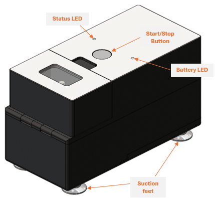
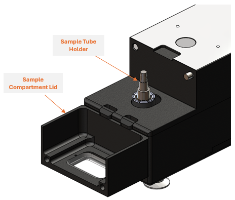
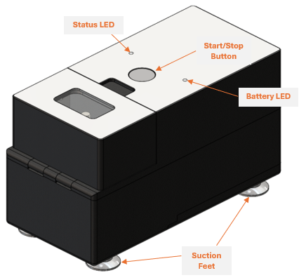
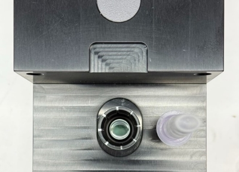

# User Guide

## Overview

The original intended use for the nPOC-BB is as a sample preparation device that liberates Mtb nucleic acid from tongue swab specimens for downstream nucleic acid testing. The performance of this device on other specimen types or other microbial targets has not been established.

!!! note
    The nPOC-BB is intended for use only with the Sample Prep Tube as the timing steps and geometry are customized to the consumable.

The following table provides a list of supplies that are required for nPOC-BB function:

| Material | Description | Manufacturer |
|----------|-------------|--------------|
| Sample Prep Tube | Single-use, disposable tube containing buffer and reagents required to process a tongue swab specimen that is collected from patients and is suspected to contain Mtb. | Kang-Jia (Catalogue No. KJ7025-3ML) |
| Dropper Tip Cap | Single-use, disposable cap containing a filter and dropper tip required to transfer processed patient specimens into the workflow for a nucleic acid amplification test. | Kang-Jia (Catalogue No. KJ7025-3ML with custom filter) |
| Tongue Swab (Dry Transport, 30mm breakpoint) | Single-use, disposable, flocked swab to be used to collect a tongue swab specimen that is from patients and is suspected to contain Mtb. | Copan (Catalogue No. 520CS01) |

## Device Description

The nPOC-BB is a battery powered device that utilizes the fundamental principles of heat combined with mechanical bead beating to effectively lyse biological samples. The device contains batteries, heaters, sensors, a motor, an LED to designate battery status, an LED to designate operational status, a Start Button, a power button, a USB-C Port for programming and data transfer, integrated software to facilitate automated testing, and integrated storage to capture test run data (Figures 1–3).

The operational status and battery state of the nPOC-BB is signaled to the test operator using designated, integrated LEDs (one for each state; see [Notifications Specification](../outputs/notifications.md)).

The nPOC-BB has a single accessible compartment with a magnetic lid where an individual can insert and process a single test sample per run. The sample will be subjected to an automated protocol based on the fundamental properties of bead beating and will both heat and vibrate the sample. The sample processing protocol takes approximately 6 minutes and can be monitored via the Status LED.

/// caption
Figure 1: Isometric view of the front, side and top of the nPOC-BB (Gamma) unit.
///

/// caption
Figure 2: Interior view of the Sample Compartment with the Sample Tube Holder.
///

/// caption
Figure 3: Isometric view of the back, side, and top of the nPOC-BB (Gamma) unit.
///

## Instructions for Preparing a Sample Prep Tube

!!! warning
    Follow all recommended safe handling procedures and don appropriate PPE when interacting with patient-derived, potentially infectious specimens.

1. Obtain a dry transport flocked swab and label appropriately with specimen and study IDs. Collect a tongue swab specimen from patient.

    !!! note
        Tongue swab specimens can be collected from patients directly at the testing site, or specimens can be collected and transported dry in the tube to the testing site or lab.

2. Obtain a Sample Prep Tube and Dropper Tip Cap from the test kit and label appropriately with specimen and study IDs.
3. Open Sample Prep Tube by peeling off the foil seal.
4. Insert the head of the tongue swab specimen into the Sample Prep Tube and break off the swab head directly into the Sample Prep Tube. Cap with the Dropper Tip Cap. Ensure the dropper tip cap is twisted sufficiently to fully seal. The cap should be completely seated on the top ridge of the sample Prep Tube with no visible threading or gap.

    !!! note
        If swab does not have breakpoint the swab head can be clipped off into the Sample Prep Tube.

    !!! note
        Performance of the nPOC-BB has been established on tongue swab specimens wherein the head of the tongue swab is broken off into the sample prep consumable tube and remains inside the tube during sample processing. If the swab head is not included during sample processing the lysis efficiency is reduced.

## Operating Instructions

### Sample Processing

1. Place the nPOC-BB on a flat and debris free surface. Ensure the Suction Feet are firmly attached to the surface.
2. Ensure the power switch is in the “On” position.
3. *IF OPERATING ON BATTERY POWER*: Check the battery state of charge before initiating sample processing cycle. If the Battery LED is RED, charge the device until reaching sufficient charge (Battery LED: YELLOW) before operation.
4. To open the magnetic closure on the Sample Compartment Lid, grasp the lid just below the Start/Stop Button below the arrow icon and rotate/pull the lid open by pulling in the direction indicated by the arrow (i.e., towards the operator if the device is in the orientation depicted in Figure 1).
5. Insert the Sample Prep Tube into the nPOC-BB tube holder and ensure that the tube is fully seated and clicks into place under the retention collar.

    !!! note
        The Sample Prep Tube geometry narrows into ovals, not circles. This requires that the tube is inserted into the device in the correct orientation. Ensure the Sample Prep Tube cap is facing up and the tube is oriented so that the long axis of the oval is parallel to the lid hinge (Figure 4).

    
    /// caption
    Figure 4: Correct orientation of Sample Prep Tube when placing into the Sample Tube Holder.
    ///

6. Close the magnetic lid.
7. Press the Start Button to start a cycle. The sample preparation is completed when shaking stops and the Status LED is GREEN.

    !!! warning "Caution"
        Look through the clear sample compartment window prior to opening the device to ensure that no sample has escaped the tube prior to opening the Sample Compartment Lid.

8. Open the Sample Compartment Lid and remove the Sample Prep Tube. The sample is now ready to be transferred.

    !!! note
        Sample Prep Tube will be warm when removed from the nPOC-BB.

## Status Interpretation and Troubleshooting

### Test Initiation and Grace Period

When a run is initiated, there is a grace period of 30 seconds before the sample processing protocol begins where the module waits to allow the user to cancel or restart a run without consuming the Sample Preparation Tube. The run can be aborted within the first 30 seconds of testing by either pressing the Start/Stop Button or opening the Sample Compartment Lid. In this scenario the Status LED will flash YELLOW. Yellow flashing indicates that the Sample Preparation Tube was not heated and is still valid to use for testing.

If a test is stopped too late and sample processing has been initiated the LED will flash RED. Red flashing indicates that the sample preparation process was not completed, the run was aborted by the operator, and the Sample Prep device is consumed and is not valid for further downstream testing.

### Stopping/Aborting a Run

If there is an issue noticed with the sample, or the device and the run need to be terminated prematurely the recommended procedure is to press the Start/Stop Button.

The run will also stop prematurely if the Power Switch is turned off on the back of the device or if the Sample Compartment Lid is opened during the run.

### Charging and Battery Indication

If there is no mains power available, then devices can be processed in the nPOC-BB on battery power alone. When the modules’ battery is fully charged it should be able to process 60 samples before it is depleted. To check the battery storage level the USB charger must be removed from the device.

When USB charger removed if the Battery LED shows WHITE then the battery is >90% charged. If it shows YELLOW, it has enough charge for at least one (1) run and if it shows RED then the charge level is too low, and it will not allow a run to start.

When the module is plugged in and charging the battery, the LED will be breathing BLUE. It takes approximately 4.5 hour to charge the battery to full charge.

### Troubleshooting

It is recommended to keep the unit plugged and fully charged to avoid any disruptions or run variability that may occur with a low battery. If a unit errors but otherwise appears to be functioning properly it is recommended to download the data using the [Data Wrangler software](https://github.com/Global-Health-Labs/nPOC-BB/tree/main/sw_tools/python/py_npoc-bb_wrangler){:target="_blank"} and then the unit should be power cycled by turning the power switch at the back of the unit off and on again.

If the Status LED indicates flashing purple and yellow, indicated a critical device error, or there are repeated issues with a module (stops prematurely, results in an error) then it should be removed from service.

### Cleaning and Disinfection

Exterior surfaces can be cleaned using a damp cloth soaked with either a 10% bleach solution (sodium hypochlorite) or PREempt™ RTU (hydrogen peroxide), followed by immediately wiping with a damp cloth soaked in 70% isopropyl alcohol (IPA) solution. Do not spray cleaning solvent directly onto or into module.
