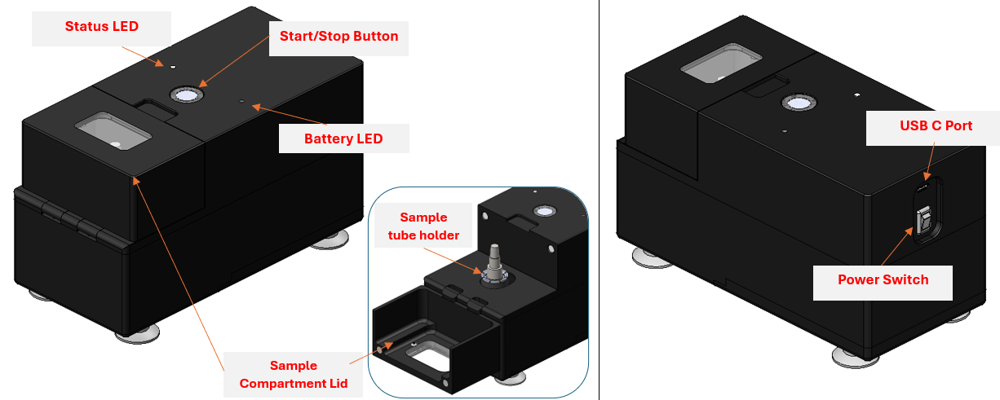

# Quick Start

1. Place the nPOC-BB unit on a flat and debris-free surface.
2. Ensure the unit is well-adhered via its suction feet to the surface.
3. Ensure the Power Switch is on and Battery LED is yellow or white.
4. Open the Sample Compartment Lid and insert the Sample Tube into the Sample Tube Holder. Ensure the Sample Tube is aligned properly and press the Sample Tube firmly so that it clicks into the Sample Tube Holder.
5. Close the Sample Compartment Lid and press the Start Button. Observe the Status LED change to breathing green.
6. Wait 8.5 minutes.
7. When both Status and Battery LEDs turn to solid green the cycle is complete. Open the front cover and remove the Sample Tube.
8. Transfer the lysed sample into a test consumable for operation in a downstream NAAT via the small dropper cap of the Sample Tube.

!!! warning
    Sample Prep Tube will be HOT when removed from device.
