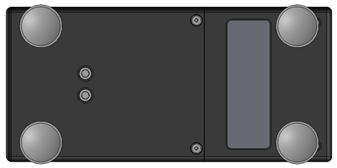
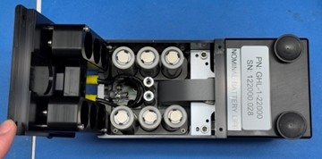
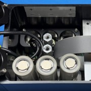
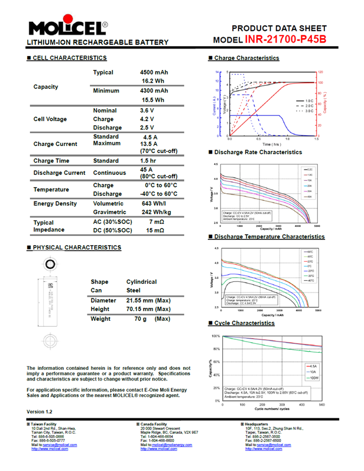

# Batteries Replacement Guide (Gamma)

## Overview

Note that this batteries replacement procedure for the nPOC-BB (GHL prototype version Gamma) has attendant risks. Accessing the internal electronics of the module is a significant risk to the user and others if batteries or wires are not handled properly. This procedure should only be done when necessary, such as placing the unit in long term storage or to accommodate shipping requirements. This guide outlines the specifications for acceptable battery replacements and provide step-by-step instructions for safely removing and replacing batteries.


/// caption
Figure 1: Isometric view of the front, side and top of the Sample Prep module.
///


/// caption
Figure 2: Isometric view of the back, side and top of the Sample Prep module.
///

## Battery Specifications

Existing nPOC-BB (Gamma) units are installed with manufacturer specified batteries – [Molicel INR-21700-P45B](#datasheet). If this battery is unavailable, replacement battery cells with equivalent specifications are likely acceptable.

In additional to the previously mentioned battery specifications, the following are key battery requirements specific to the design of nPOC-BB (Gamma):

1. Unprotected cells[^1].
2. Continuous discharge rating of 3 A or above.
3. Charge/discharge temperature rating of 60° C or above[^2].
4. Maximum diameter of 21.55 mm[^3].
5. All cells in a unit should be at the same state of charge before installing them into the unit.

!!! warning
    Failure to follow these specifications may result in a fire or destructive failure of the unit.

## Instruction for Balancing Battery Cells

Battery cells are installed in a nPOC-BB (Gamma) unit in the same state of charge to prevent overcharging/discharging of individual cells.

1. Measure the battery cells voltage using a multimeter. Record the value for each of the cells.
2. Select 6 battery cells that have the voltage within 10 mV of each other.
3. Ensure the balanced cells are installed in the same unit.

## Instruction for Batteries Replacement

1. Ensure the unit is unplugged, and the power switch (next to the USB port) is in the off position.
2. Place the unit upside down on a stable surface.
3. Remove the 4-40 screws first (Figure 3 below).

    !!! note
        The order of removing 4-40 screws before 10-32 screws (Step 4) is important. Reversing the order of operation could cause damage to the threads.

4. Apply downward pressure on the battery cover to counteract the spring force while loosening and removing the 10-32 screws (Figure 3).
5. Gently lift the battery cover vertically up to clear the batteries, then rotate cover 90 degrees towards the back side of the unit (the side with power switch and USB port, see Figure 4). Be aware that the two power cables are still attached to the battery cover.
6. Remove the batteries from the battery holder.
7. Insert new and balanced batteries into the battery holder with the correct polarity: **negative (-) facing the spring and positive (+) facing the battery cover opening**.

    !!! warning

        It is critical the cells are installed with the correct polarity. Improper installation can result in a fire hazard.

8. Place the battery cover on the unit by aligning the battery holder slots with the batteries.
9. Remove the residual Loctite (blue) from the screw threads by using a soft wire brush. Alternatively, replace the screws with new screws[^4].
10. Apple a drop of Loctite 425 on each screw.
11. Press down on the battery cover to counteract the spring force and tighten the 10-32 screws (Figure 3) until the battery cover is securely fastened and level with the housing.

    !!! note
        The order of tightening the 10-32 screws (Step 11) before the 4-40 screws is important. Reversing the order of operation could cause damage to the threads.

12. Tighten the 4-40 screws (Figure 3).

    
    /// caption
    Figure 3: Bottom of the nPOC-BB (Gamma) showing the battery cover and the screws location.
    ///

13. Plug in the USB cable and turn on the power switch (required to restart the device). When completed, the Battery LED will show breathing blue.
14. The Real Time Clock (RTC) is powered by the 21700 batteries and must be reset after the batteries are replaced to ensure proper logging function.


/// caption
Figure 4: Internal view of the nPOC-BB (Gamma) with all battery cells in place.
///


/// caption
Figure 5: Internal view of the nPOC-BB (Gamma), with top row of batteries removed showing the polarity label.
///

## Instruction for Resetting the Real Time Clock

1. Ensure the power switch is in the on position.
2. Connect the nPOC-BB (Gamma) unit to a PC via USB cable.
3. Press and hold the Start/Stop button on the top of the unit. The two LED lights should turn blue and slowly breathing.
4. Access files as an external drive via PC.
5. Open the config folder, then open the ```config_vX.X.txt``` file (```X.X``` is the version number).
6. Enter the today’s date in the ```mmddyy``` field.
7. Enter the current time in the ```hhmmss``` field.
8. Enter ```true``` in the ```set_time_date``` field.
9. Save and close the file.
10. Eject the external drive.
11. Disconnect the unit from PC.
12. Press the Start/Stop button. The RTC is now reset.

## Manufacturer Specified Battery Datasheet

<a name="datasheet" target="_blank" rel="noopener noreferrer" href="https://www.molicel.com/inr21700-p45b/"></a>

[^1]: The nPOC-BB (Gamma) units are not compatible with protected cells because the units have internal battery protection circuit.
[^2]: The nPOC-BB (Gamma) units cannot protect against over-temperature cell damage if this rating is lower because the units have a cutoff temperature of 59 °C.
[^3]: The nPOC-BB (Gamma) units accept a maximum battery cell diameter because they were designed to accommodate normal swelling of the cells during use.
[^4]:
    Replacement screws: <a target="_blank" rel="noopener noreferrer" href="https://www.mcmaster.com/catalog/131/3486/92210A108">stainless steel 4-40 x 3/8” long flat head screws</a> (Qty: 2) and <a target="_blank" rel="noopener noreferrer" href="https://www.mcmaster.com/catalog/131/3567/92196A273">stainless steel 10-32 x 7/8” socket head screws</a> (Qty: 2).
