# Software Tools

## Firmware Flashing

## Firmware Development

### Development Environment

- Segger Embedded Studio software version 5.34 was originally used to develop the firmware. Later versions may also work.
- nRF Connect software was used to upload the firmware.
- An nRF PCA10040/56 or a Segger programmer connected to a 6-pin JTAG programming cable was used to properly program and communicate to the boards via both Segger Embedded Studio and nRF Connect.

### Development Instructions

Open the code in Segger Embedded Studio go to ```ProjectDir/application/solution/```. In this directory there should be ```NAATOS_fw.emProject``` which is the project file and can be double clicked to open the project inside of Segger Embedded Studio.

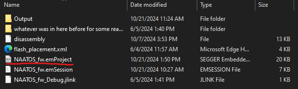

For opening the bootloader project, follow the same steps except follow the path ```ProjectDir/bootloader/solution/``` and open ```NAATOS_bootloader.emProject```.

### Debug / Release Modes

Switching the project between Debug and Release can be done inside of the Project Explorer tab of Segger Embedded Studio.  

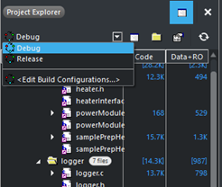

In most cases, the project should be inside of Debug mode when building the firmware. The only time the Release mode should be used for would be when creating final firmware builds to keep the optimization as high as possible and memory usage as low as possible.  

For the bootloader, ONLY the release mode should be used and not the debug mode. Building and using the bootloader inside of Debug mode will lead to the Bootloader not working and unable to update firmware properly.  

When building the application code, certain memory spaces may have to be changed depending on whether the resulting .hex file being produced will be used with or without a bootloader. The two cases being one where the bootloader is being used on the device and one that is not.  Depending on this the memory map for the device will need to be changed.  

When simple testing is required, and the bootloader is not needed on the board the memory space for the device needs to be modified so that it does not expect bootloader code within its memory.  This is done by modifying the linker options of the project. Follow these steps to modify the linker options:

1. Right click the project in the Project Explorer tab of Segger Embedded studios and select Options.  
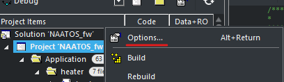

2. Choose the build type for the Options, and set it to Common.  
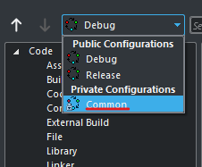

3. Select Linker in the Options.  
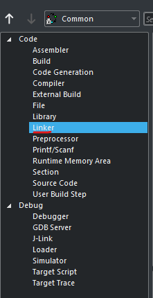

4. Double click on the Section Placement Macros  
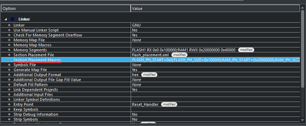

5. A property editor should then come up on the screen.  
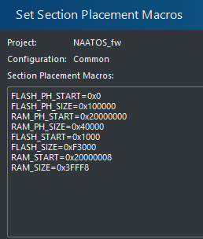

6. Replace the Text with the following to make the application run without the need of a bootloader flashed onto the device:

        FLASH_PH_START=0x0
        FLASH_PH_SIZE=0x100000
        RAM_PH_START=0x20000000
        RAM_PH_SIZE=0x40000
        FLASH_START=0x0000
        FLASH_SIZE=0xF3000
        RAM_START=0x20000000
        RAM_SIZE=0x40000

    If the device is being programmed and the firmware image is expecting to have a bootloader on the device and contain the full firmware the following options need to be set:  

        FLASH_PH_START=0x0 
        FLASH_PH_SIZE=0x100000 
        RAM_PH_START=0x20000000 
        RAM_PH_SIZE=0x40000 
        FLASH_START=0x1000 
        FLASH_SIZE=0xF3000 
        RAM_START=0x20000008 
        RAM_SIZE=0x3FFF8 

### Bootloader

Triple press the start button for the board to enter the bootloader from the application firmware. Bootloader must be programmed onto the board to enter the mode, or we will end up in a hard fault state with the device crashing.  

There are 4 required files for full firmware programming of the device. The application firmware hex file, the bootloader firmware hex file, the master boot record hex file, and the bootloader settings hex file.

The application firmware hex file is the application code that we will be flashing onto the board and is generated with each revision of application firmware changes and can be overwritten.

The bootloader firmware hex file is the bootloader code that we will be flashing onto the board and is generated only once and cannot be overwritten.  

The master boot record is a static record of the bootloader and is taken from the nRF52840 SDK and not modified for this application, this cannot be overwritten.

The Bootloader settings hex file is the setting for the bootloader to run on and tells the bootloader what to expect on a firmware upgrade. This can be regenerated as necessary but should not need to be as the bootloader will remain static. The creation script for this file will be provided.

To program the bootloader onto the device, Segger Embedded Studio cannot be used and nRF Connect must be used.  


Once nRF connect is downloaded and opened, you will want to open the Programmer Tool to program the device. The Programmer Tool will then open and the nRF52 DK can be selected as the programmer by clicking in the top left and selecting the nRF52 DK.  

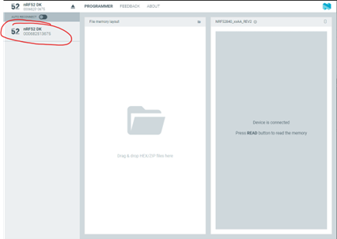

Next all the firmware files can then be loaded into the Programming tool.  

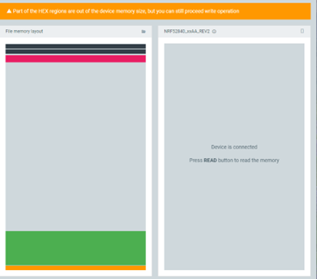

When all firmware files are added to the programmer the File memory layout section should look like above.  

Note: Ensure that the generated application firmware hex file is generated with the correct memory layout and expects the bootloader to be there.  

When the firmware files are loaded into the programmer the Erase and Write button can be pressed to write the full firmware to the device.  

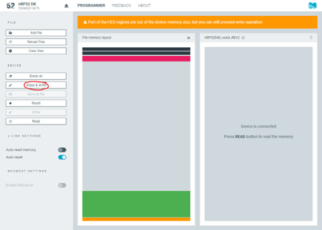

There should be no red messages in the console log and the finishing programming line should be 'Reading readback protection status for Application core completed'.

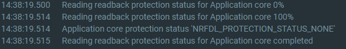

After this the device has been fully programmed and has both the bootloader and the application firmware on the device and is ready for operation and future upgrades via the bootloader.  

### Generate Upgrade Package

To generate a package, first ```nrfutils``` must be installed which runs the entire firmware upgrade creation and flashing process. Can be downloaded here.

To create a package the following command must be run with ```nrfutils```:

    nrfutil pkg generate --hw-version 52 --sd-req 0x00 --application-version 4 --application Path/To/Application/Hex/File --key-file Path/To/Key/File naatos_dfu_package.zip 

This command takes in the newly created application firmware hex and our Odic generated key file which will be provided to create a .zip upgrade package with the given application firmware hex file.  

A script will also be provided which can be run to create a firmware upgrade package when the correct paths are set inside of it.  

### Flashing Upgrade Package

Now to flash the device, it must first be put into bootloader mode via clicking the button 3 times on the device. The device should then open a COM port on the computer which can be seen inside of the device manager for Windows.  

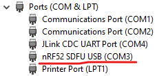

The COM port for the bootloader should be named ‘nRF52 SDFU USB’, run the following command with the COM port replacing COM_PORT:

    nrfutil dfu usb-serial -pkg naatos_dfu_package.zip -p COM_PORT -b 115200 

The firmware should then begin uploading to the device and updating it.

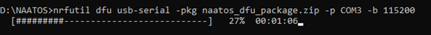

A script in which the COM port is used as a parameter to run will also be provided for ease of use.
